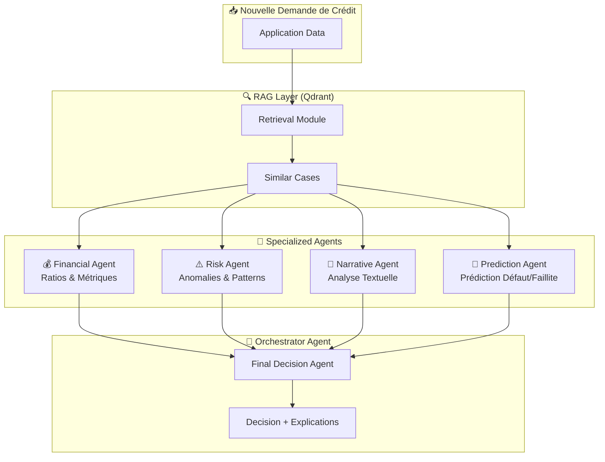

# Credit Decision Memory: Multi-Agent RAG System

## Architecture Overview

Un système multi-agents intelligent pour l'évaluation de crédit utilisant **LangGraph** pour l'orchestration, **Qdrant** pour le RAG, et **OpenAI GPT-4o-mini** (modèle économique ~$0.15/1M tokens input).



---

## Technologies Utilisées

| Composant | Technologie |
|-----------|-------------|
| Orchestration | LangGraph |
| Vector Database | Qdrant Cloud |
| LLM | OpenAI GPT-4o-mini |
| Embeddings Dense | Ollama (mxbai-embed-large) |
| Embeddings Sparse | FastEmbed (Qdrant/bm42-all-minilm-l6-v2-attentions) |
| Interface Web | Streamlit |
| PDF Generation | ReportLab |

---

## Agents Details

### 1. Financial Metrics Agent 💰

| Responsabilité | Métriques Analysées |
|----------------|---------------------|
| Clients | `debt_to_income_ratio`, `missed_payments`, `income_annual`, `credit_utilization` |
| Startups | `burn_multiple`, `runway_months`, `arr_growth_yoy`, `cac_ltv_ratio` |
| Enterprises | `altman_z_score`, `current_ratio`, `debt_to_equity`, `interest_coverage` |

### 2. Risk Pattern Agent ⚠️

- Calcul de distance aux clusters historiques
- Détection de profils atypiques (outliers)
- Identification de combinaisons de features dangereuses
- Score d'anomalie basé sur la position dans l'espace vectoriel

### 3. Narrative Analysis Agent 📝

- Analyse du `credit_history` (clients)
- Analyse du `pitch_narrative` (startups)
- Analyse du `annual_report_risk_section` (enterprises)
- Extraction de sentiments et signaux d'alerte

### 4. Prediction Agent 🔮

- **Pour Clients**: Prédiction de défaut de paiement
- **Pour Startups**: Prédiction de runway insuffisant / échec
- **Pour Enterprises**: Prédiction de faillite (zone Altman)
- Timeline: Estimation de QUAND le risque se matérialisera

### 5. Advisor Agent 💡

- Identifie les points faibles du profil
- Propose des Quick Wins (actions rapides)
- Plan d'action détaillé avec priorités (HIGH/MEDIUM/LOW)
- Stratégie long terme pour amélioration

### 6. Expert Comptable Chatbot 💬

- Assistant IA interactif pour questions financières
- Ne répond qu'aux questions liées à la finance
- Contexte enrichi avec les données du demandeur
- Historique de conversation

---

## Cost Estimation

| Action | Tokens Estimés | Coût (gpt-4o-mini) |
|--------|----------------|---------------------|
| 1 analyse agent | ~500 tokens | ~$0.0003 |
| 6 agents + orchestrateur | ~4000 tokens | ~$0.002 |
| **100 analyses** | ~400K tokens | **~$0.25** |

> **Avec un budget de $10, vous pouvez effectuer ~4000 analyses complètes.**

---

## File Structure

```
hackthon/
├── agents/
│   ├── __init__.py
│   ├── config.py           # Configuration centralisée
│   ├── schemas.py          # Schémas Pydantic
│   ├── rag_retriever.py    # Module RAG Qdrant
│   ├── financial_agent.py  # Agent métriques
│   ├── risk_agent.py       # Agent risques
│   ├── narrative_agent.py  # Agent narratif
│   ├── prediction_agent.py # Agent prédiction
│   ├── orchestrator.py     # Orchestrateur LangGraph
│   ├── advisor_agent.py    # Agent conseiller
│   ├── expert_chatbot.py   # Chatbot expert comptable
│   └── pdf_generator.py    # Génération PDF
├── data/
│   ├── clients.json        # 5000 clients
│   ├── startups.json       # 2500 startups
│   └── enterprises.json    # 1000 entreprises
├── ingestion/
│   └── ingest.py           # Script d'ingestion Qdrant
├── docs/
│   ├── implementation_plan.md
│   └── walkthrough.md
├── app.py                  # Interface Streamlit
├── main.py                 # Point d'entrée CLI
├── requirements.txt        # Dépendances
└── README.md               # Documentation
```

---

## Verification Plan

### Automated Tests

```bash
# Test de connexion Qdrant
python -c "from agents.rag_retriever import test_connection; test_connection()"

# Test de configuration
python -c "from agents.config import validate_config; validate_config(); print('OK')"

# Test du système complet
python main.py --demo
```

### Manual Verification

1. Soumettre une demande client avec profil "safe" → Attendre APPROVED
2. Soumettre une startup avec runway < 3 mois → Attendre REJECTED
3. Soumettre une enterprise avec Altman Z < 1.8 → Attendre risque de faillite détecté
4. Vérifier que les explications citent des cas similaires pertinents
